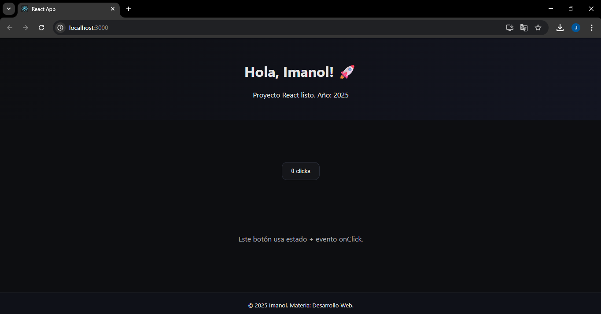

# Mi Primera App React

Este repositorio contiene el **Trabajo Práctico** de la materia **Desarrollo Web**  
(Tecnicatura Superior en Análisis de Sistemas Informáticos - 2° Año).

---

## 👨‍🎓 Autor
- **Nombre:** Imanol Sequeira  

---

## 🚀 Proyecto
Este proyecto fue creado con **Create React App (CRA)** y modificado para incluir:
- Uso de **JSX**  
- Un ejemplo de **estado** con `useState`  
- Un **evento onClick**  
- Estilos personalizados en `App.css` e `index.css`  

---

## 📦 Instalación y ejecución
Para ejecutar este proyecto en tu computadora:

1. Clonar el repositorio:
   ```bash
   git clone https://github.com/imanxl000/mi-primera-app-react.git
   cd mi-primera-app-react
   ```

2. Instalar dependencias:
   ```bash
   npm install
   ```

3. Iniciar servidor de desarrollo:
   ```bash
   npm start
   ```
   Se abrirá en 👉 [http://localhost:3000](http://localhost:3000)

---

## 📚 Tecnologías utilizadas
- React (Create React App)  
- Node.js + npm  
- JSX, Hooks y eventos  

---

## 📸 Captura de pantalla


---

## ✅ Estado del proyecto
Proyecto funcionando correctamente.
